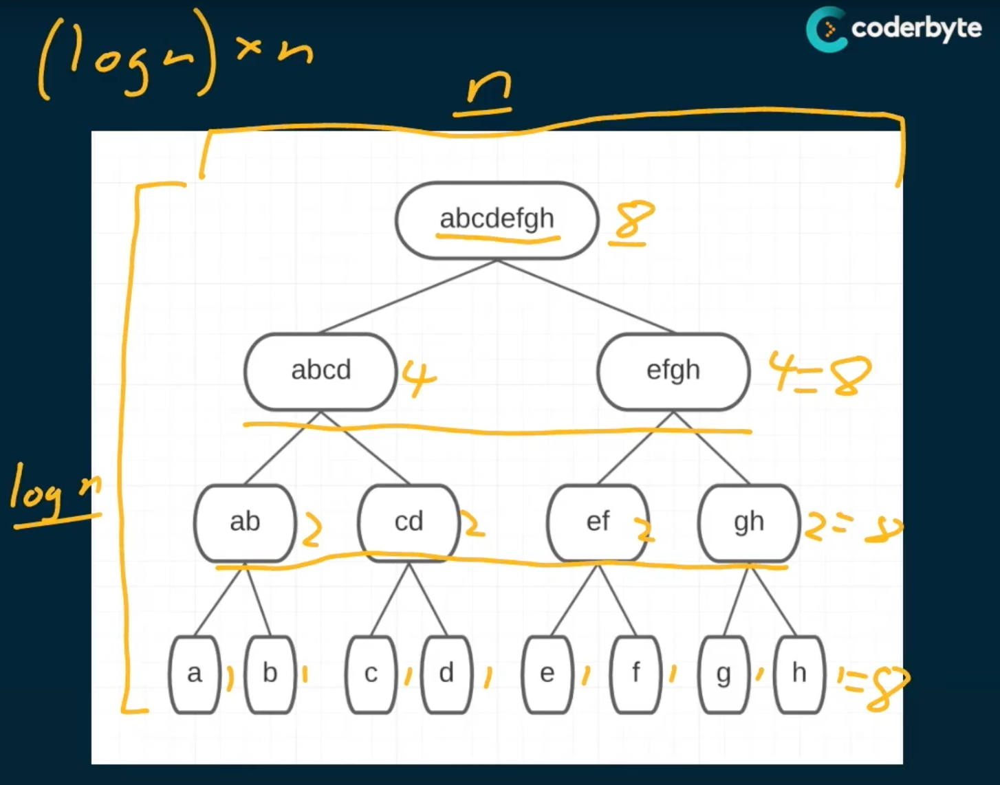

# Loglinear O(n * log(n))
 - has linear behavior nested in log steps
 - bigger than O(n) but smaller than O(n^2)

Examples:

```js
// log(n) from doing the / 2 over and over
//
// str.slice is operating on the input string and giving a copy, and that
// scales with the length of the string. So for the n long string it does n/2 copying.
// but the n/2 simplifies to n
//
// So combined it gives n * log(n)

const bar = (str) => {
  console.log(str);
  
  if (str.length <= 1) return;
  
  const midIndex = Math.floor(str.length / 2);
  bar(str.slice(0, midIndex));
}

bar('abcdefgh');
// abcdefgh
// abcd
// ab
// a
```
---



```js
/**
 * height of the tree created is: log(n)
 * the loop is: n
 * the width is: n
 * 
 * so the overall is: O(log(n) * n))
 */
const foo = (array) => {
  let str = '';
  for (let i = 0; i < array.length; i++) {
    str += array[i];
  }
  console.log(str);
  console.log('-------');
  
  if (array.length <= 1) return;
  
  const midIndex = Math.floor(array.length / 2);
  const left = array.slice(0, midIndex);
  const right = array.slice(midIndex);
  
  foo(left);
  foo(right);
}

foo(['a', 'b', 'c', 'd', 'e', 'f', 'g', 'h'])
// abcdefgh
// -------
//   abcd
// -------
//   ab
// -------
//   a
// -------
//   b
// -------
//   cd
// -------
//   c
// -------
//   d
// -------
//   efgh
// -------
//   ef
// -------
//   e
// -------
//   f
// -------
//   gh
// -------
//   g
// -------
//   h
// -------
```
