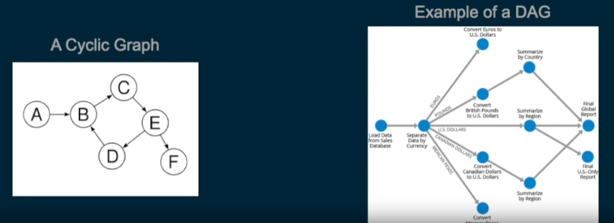

# Graph

 - Data structure made up of nodes and vertices and edges or the connections between the nodes
 - Typically, a visualisation of a graph will be of nodes represented by circles and edges as lines between the circles

## Tree vs graph:
 - trees are just a special kind of graph with one root and only one unique path between any two nodes
 - a graph can go beyond that and have any number of root elements and multiple paths between the nodes

### Example

```js
/**
 * (a) --- (b)
 *  |     /
 *  |  (c)
 *  | /   \
 * (d) --- (e)
 */

const vertices = ["a", "b", "c", "d", "e"];
const edges = [
  ["a", "b"],
  ["a", "d"],
  ["b", "c"],
  ["c", "d"],
  ["c", "e"],
  ["d", "e"],
];
```

Time complexity to find adjacent nodes: `O(e)` where `e` is the number of edges.

Time complexity to check if two nodes are connected: `O(e)` where `e` is the number of edges.

Space complexity: `O(v + e)` where `v` is the number of vertices and `e` is the number of edges.

### Adjacency matrix

A 2D array filled out with 1s and 0s where each array represents a node and each index in the subarray represents a potential connection to another node.

The value at `adjacencyMatrix[node1][node2]` indicates where there is a connection between node1 and node2.

Time complexity to find adjacent nodes: `O(v)` where `v` is the number of vertices.

Time complexity to check if two nodes are connected: `O(1)` (as you check for value at fixed position).

Space complexity: `O(v^2)` where `v` is the number of vertices.

```js
/**
 * (a) ---(b)
 *  |    /
 *  |  (c)
 *  | /   \
 * (d) --- (e)
 */

const vertices = ["a", "b", "c", "d", "e"];
const adjacencyMatrix = [
  [0, 1, 0, 1, 0],
  [1, 0, 1, 0, 0],
  [0, 1, 0, 1, 1],
  [1, 0, 1, 0, 1],
  [0, 0, 1, 1, 0]
];
```

That matrix is symmetrical (top-left to bottom-right axis). 

### Adjacency list

For every node, store a list of what nodes it's connected to.

Time complexity to find adjacent nodes: `O(1)`.

Time complexity to check if two nodes are connected: `O(log(v))` where `v` is the number of vertices IF each adjacent row is sorted. Log, because search is done.
If it is not sorted, it will be `O(v)`.

Space complexity: `O(e)` where `e` is the number of edges.

```js
/**
 * (a) ---(b)
 *  |    /
 *  |  (c)
 *  | /   \
 * (d) --- (e)
 */

const vertices = ["a", "b", "c", "d", "e"];
const adjacencyMatrix = [
  ['b', 'd'], // a
  ['a', 'c'], // b
  ['b', 'd', 'e'], // c
  ['a', 'c', 'e'], // d
  ['c', 'd'] // e 
];
```

### Directed vs Undirected Graphs

1. In an **Undirected Graph**, when there is a connection between nodes, it goes both ways.
 
   - E.g. Facebook and its users and the relationships between the users can be modeled as undirected graph
   - Users are nodes and friendships between the users are edges.
   - There may be many ways two users are connected on F. The graph is undirected because if you are friends with someone onF, they are by definition friends with you in return.

2. In a **Directed Graph**, connections between nodes have direction

   - The internet can be modeled as a directed graph, where individual web pages are nodes and links between the pages are directed graphs.
   - E.g. I have a link to Facebook, but F. doesn't need to have a link back to my page.
   - The degree of a node is the number of edges connected to the node. 
   - In a directed graph, nodes have an indegree or edges pointing to it and an outdegree or edges pointing from it.

### Bipartite graph

A graph whose vertices can be divided into two disjointed and independent sets such that every edge connects a vertex in the first set to one in the second set.

```js
/**
 * (a) --- (b)
 *    \   /
 *      X
 *    /   \
 * (c) --- (d)
 */
```
 
 - if cycles are present, they are composed of even, not odd, number of nodes

#### Graph coloring

 - A way of labeling nodes or edges in a graph.
 - **Legal coloring** - a graph coloring such that no neighboring nodes share the same color

```js
/**
 * G - green
 * Y - yellow
 * 
 * (G) --- (Y) legal
 * (Y) --- (G) legal
 * (Y) --- (Y) Not legal
 * (Y) --- (G) --- (Y) Legal
 */

```
   
### Weighted vs Unweighted Graphs

 - A **Weighted Graph** is a graph in which the edges have values corresponding to weights
   - For example, an intercity road network could be an example of a weighted graph, where each city is a node and each road is an edge, labeled with their lengths (distance between the cities)
 - An **Unweighted Graph** has no weights to its edges, so every edge is the same as any other edge.

### Cyclic vs Acyclic Graphs

 - In a **Cyclic Graph**, there is at least one cycle, meaning that there is a path from at least one node back to itself
 - An **Acyclic Graph** means the graph contains no cycles aka no node can be traversed back to itself.
 - Both of these graphs can be directed or undirected. **Directed Acyclic Graphs (DAGs)** have special applications in computer science and can often be used to represent any complex data processing flows.
 


### Dense vs Sparse Graphs

 - **Dense graph** - close to the maximum numbers of edges
 - **Sparse graph** - the number of edges is close to the number of nodes in the graph
 - **Self-loop** - when an edge has just one vertex (like a web page linking to itself)
 - **Multi-edge graphs** - a graph with no self-loops and no multi-edges

In a simple directed graph, the maximum number of edges will be equal to `n * (n-1)` where `n` is the number of nodes.

In a simple undirected graph, the maximum number of edges is `(n * (n-1)) / 2` (because there are no directions, there can only be one edge between two nodes).
